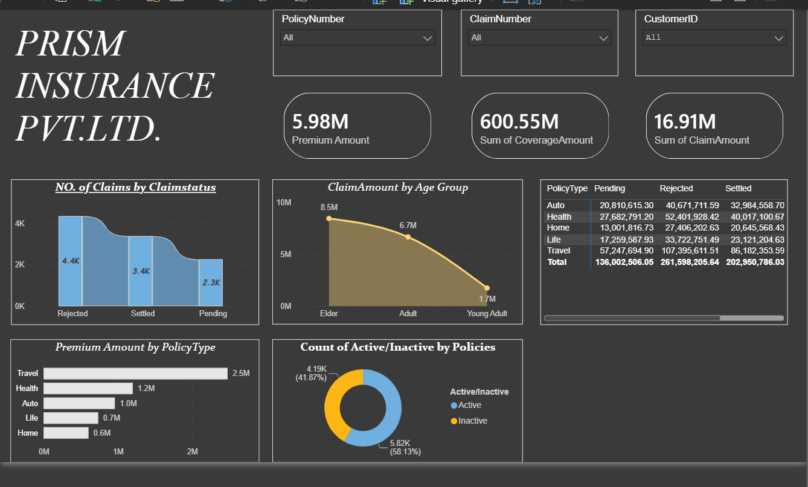
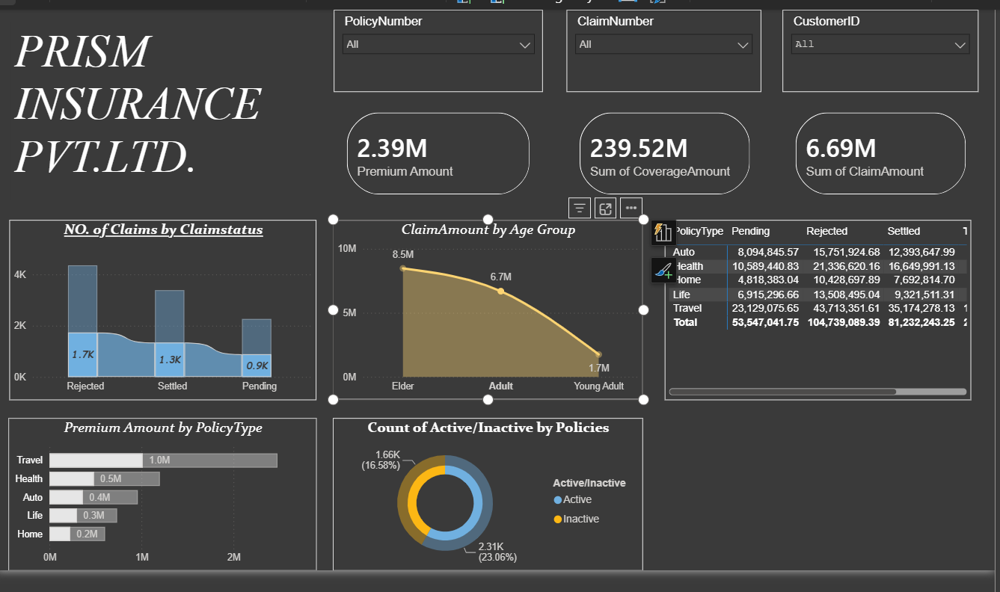
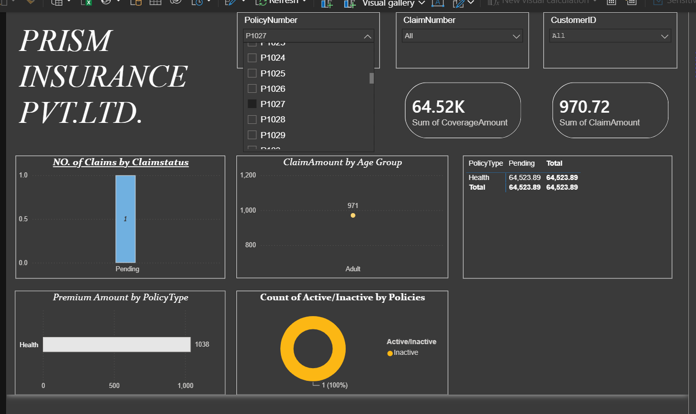

# 🛡️ Insurance Data Analysis Dashboard — Power BI


## 📊 Project Overview

This project is an interactive **Insurance Data Analysis Dashboard** developed using **Microsoft Power BI**. It analyzes insurance policies, customers, claims, coverage amounts, premium amounts, and policy activity to provide a clear view of insurance business performance.

The dashboard is designed as a **Data Analyst portfolio project**, demonstrating the complete analytics workflow from data preparation and transformation to data modeling, DAX calculations, interactive visualization, and business insight generation.

---

## 🎯 Business Objective

The objective of this project is to transform raw insurance data into an interactive business intelligence solution that can help users:

- Monitor insurance premium and coverage amounts.
- Analyze claim volume and claim amounts.
- Compare insurance performance across policy types.
- Understand claim behavior across customer age groups.
- Analyze active and inactive policies.
- Compare claim status such as **Rejected, Settled, and Pending**.
- Interactively investigate individual policies, claims, and customers.

---

## 🔍 Key Analysis Areas

### 👥 Customer & Policy Analysis

The dashboard provides interactive analysis of customers and policies using slicers for:

- **Policy Number**
- **Claim Number**
- **Customer ID**

This allows users to move from an overall business view to a specific policy, claim, or customer-level analysis.

### 📄 Policy Analysis

The dashboard analyzes five major policy types:

- Auto
- Health
- Home
- Life
- Travel

Policy performance is compared using premium amounts, claim amounts, claim status, and active/inactive policy counts.

### ⚠️ Claims Analysis

Claims are analyzed using:

- Claim status
- Claim amount
- Age group
- Policy type
- Claim count

The main claim statuses visualized are:

- Rejected
- Settled
- Pending

---

## 📌 Dashboard KPIs

The main dashboard includes KPI cards for:

| KPI | Description |
|---|---|
| **Premium Amount** | Total premium amount associated with the selected data |
| **Coverage Amount** | Total insurance coverage amount |
| **Claim Amount** | Total claim amount |

The KPI values update dynamically when users interact with the dashboard filters.

---

## 📈 Dashboard Visualizations

The dashboard contains several interactive visuals:

### 1. Number of Claims by Claim Status

A visual comparison of claim counts across:

- Rejected
- Settled
- Pending

This helps identify the distribution of claims by their current status.

### 2. Claim Amount by Age Group

Claim amounts are compared across:

- Elder
- Adult
- Young Adult

The dashboard shows a clear difference in claim amounts between age groups.

### 3. Policy Type × Claim Status

A matrix visual compares claim amounts for each policy type across:

- Pending
- Rejected
- Settled

This allows users to identify which policy categories have higher claim amounts under different claim statuses.

### 4. Premium Amount by Policy Type

Premium amounts are compared across the five policy categories.

From the overall dashboard view, **Travel insurance has the highest premium amount**, followed by Health and Auto.

### 5. Active vs Inactive Policies

A donut chart compares active and inactive policies.

In the overall dashboard view shown in the project:

- **Active:** approximately 58.13%
- **Inactive:** approximately 41.87%

This provides a quick view of the current policy activity distribution.

---

## 💡 Key Insights

Based on the overall dashboard view, the analysis highlights several important patterns:

### 🏆 Travel Policy Performance

Travel insurance contributes the **highest premium amount** among the five policy types in the overall dashboard view, making it an important contributor to premium revenue.

### 👴 Age Group Claim Pattern

The **Elder** age group has the highest claim amount in the overall view, followed by Adults and Young Adults.

The dashboard displays approximately:

- Elder: **8.5M**
- Adult: **6.7M**
- Young Adult: **1.7M**

### ⚠️ Claim Status Distribution

The overall dashboard indicates that **Rejected claims have the highest claim count**, followed by Settled and Pending claims.

Approximate counts shown in the dashboard are:

- Rejected: **4.4K**
- Settled: **3.4K**
- Pending: **2.3K**

### 🟢 Active vs Inactive Policies

The overall dashboard shows a higher proportion of active policies than inactive policies:

- Active: **58.13%**
- Inactive: **41.87%**

This indicates that active policies form the larger portion of the analyzed policy portfolio.

> **Note:** KPI values and visual results change when Policy Number, Claim Number, or Customer ID filters are applied.

---

## 🎛️ Interactive Features

The dashboard supports interactive filtering through:

- Policy Number slicer
- Claim Number slicer
- Customer ID slicer
- Cross-filtering between visuals
- Dynamic KPI updates
- Policy-level analysis
- Customer-level analysis
- Claim-level analysis

For example, selecting a single policy can reduce the dashboard to that policy's premium, coverage, claim amount, claim status, age group, policy type, and activity information.

---

## 🔄 Data Analysis Workflow

```text
Raw Insurance Dataset
        ↓
Data Cleaning & Transformation
        ↓
Data Modeling in Power BI
        ↓
DAX Measures / Calculations
        ↓
Interactive Visualizations
        ↓
Dashboard Development
        ↓
Business Insights
```

---

## 🧹 Data Preparation

The data analysis workflow includes preparation of the insurance dataset before visualization.

Typical preparation steps include:

- Reviewing the source data
- Handling missing or inconsistent values
- Correcting data types
- Standardizing categorical fields
- Preparing policy and claim fields
- Creating calculated fields/measures
- Structuring data for Power BI analysis

---

## 📐 DAX & Data Modeling

**DAX (Data Analysis Expressions)** is used to create measures and calculations required for the dashboard KPIs and visualizations.

The analytical model supports calculations related to:

- Total Premium Amount
- Total Coverage Amount
- Total Claim Amount
- Claim Count
- Policy Count
- Active/Inactive Policy Count
- Category-wise analysis

The model enables dashboard values to respond dynamically to user selections.

---

## 🛠️ Tools & Technologies

| Technology | Purpose |
|---|---|
| **Microsoft Power BI** | Dashboard development and visualization |
| **Power Query** | Data cleaning and transformation |
| **DAX** | Measures and analytical calculations |
| **Excel / CSV** | Source data preparation |
| **GitHub** | Project versioning and portfolio presentation |

---

## 🖼️ Dashboard Preview

### Overall Insurance Dashboard



### Filtered Policy Analysis



### Interactive Dashboard Analysis



> Add the screenshots to a `screenshots` folder in this repository using the filenames above.

---

## 📁 Repository Structure

```text
Insurance-Data-Analysis-PowerBI/
│
├── README.md
│
├── Insurance_Data_Analysis.pbix
│
├── dataset/
│   └── insurance_data.csv
│
├── screenshots/
    ├── dashboard_overview.png
    ├── filtered_policy_analysis.png
    └── interactive_dashboard.png
```

---

## 🚀 How to Use

1. Download or clone this repository.
2. Install **Microsoft Power BI Desktop**.
3. Open `Insurance_Data_Analysis.pbix`.
4. If the source data path is different, update it through **Power Query**.
5. Refresh the dataset.
6. Use the slicers to filter by Policy Number, Claim Number, or Customer ID.
7. Explore the dashboard visuals and insights.

---

## 🎓 Skills Demonstrated

This project demonstrates practical skills in:

- **Power BI**
- **Power Query**
- **DAX**
- **Data Cleaning**
- **Data Transformation**
- **Data Modeling**
- **Data Visualization**
- **Business Intelligence**
- **Exploratory Data Analysis**
- **Dashboard Design**
- **Business Insight Generation**

---

## 📈 Future Enhancements

Potential improvements for future versions include:

- Year-over-year claim and premium analysis
- Additional customer segmentation
- Claim ratio analysis
- Drill-through pages for customers and policies
- Advanced DAX measures
- Automated Power BI Service refresh
- Predictive claim analysis
- Customer risk segmentation
- Additional KPI cards and executive-level reporting

---

## 👨‍💻 Author

### Raj Kumar

**Aspiring Data Analyst**

**Skills:** `Power BI` · `SQL` · `Python` · `Data Analysis` · `Data Visualization`

This project is part of my Data Analyst portfolio and demonstrates my ability to transform business data into meaningful, interactive dashboards.

---

## ⭐ Portfolio Project

If you find this project useful or interesting, consider giving the repository a ⭐.

**Thank you for visiting this project!**
